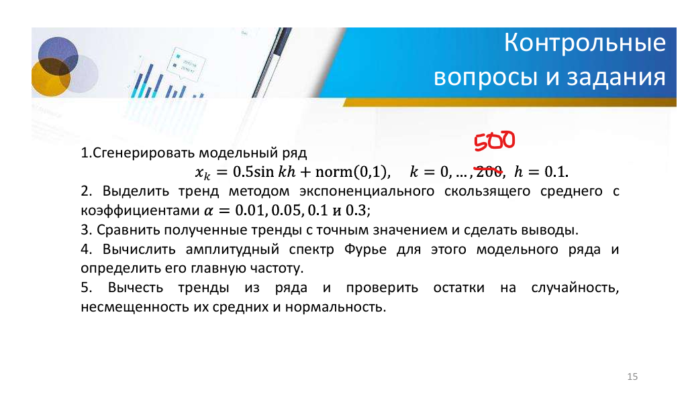

# Лабораторная работа 2

1. Сгенерировать модельный ряд
  $$ x_k = 0.5sin(kh) + norm(0,1); k = 0, ..., 500; h = 0.1. $$
2. Выделить тренд методом экспоненциального скользящего среднего с коэффициентами α = 0.01, 0.05, 0.1 и 0.3;
3. Сравнить полученные тренды с точным значением и сделать выводы. 
4. Вычислить амплитудный спектр Фурье для этого модельного ряда и определить его главную частоту.
5. Вычесть тренды из ряда И проверить остатки на случайность, несмещенность их средних и нормальность.

## Краткие выводы

Несмещенность (среднее):

- α≥0.05 → mean≈0 и t-тест p>0.05 → остатки несмещённые.
- α=0.01 → остатки смещены вниз (t-test p≈0).

Нормальность:

- все p_sh >0.5 → остатки примерно нормальные для всех α.

Случайность:

Ljung-Box и runs test:

- α=0.1 → p>0.05 → остатки случайны.

- α=0.01 и α=0.3 → низкие p → остатки автокоррелированы или последовательность знаков не случайна.
